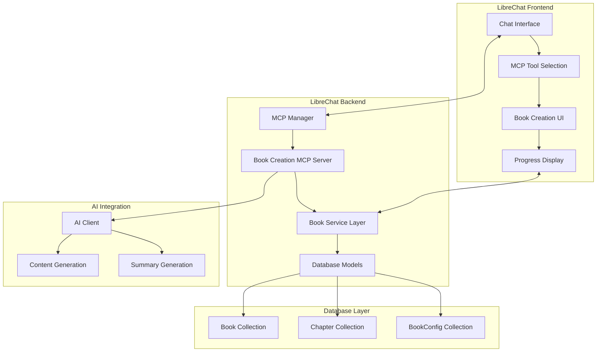
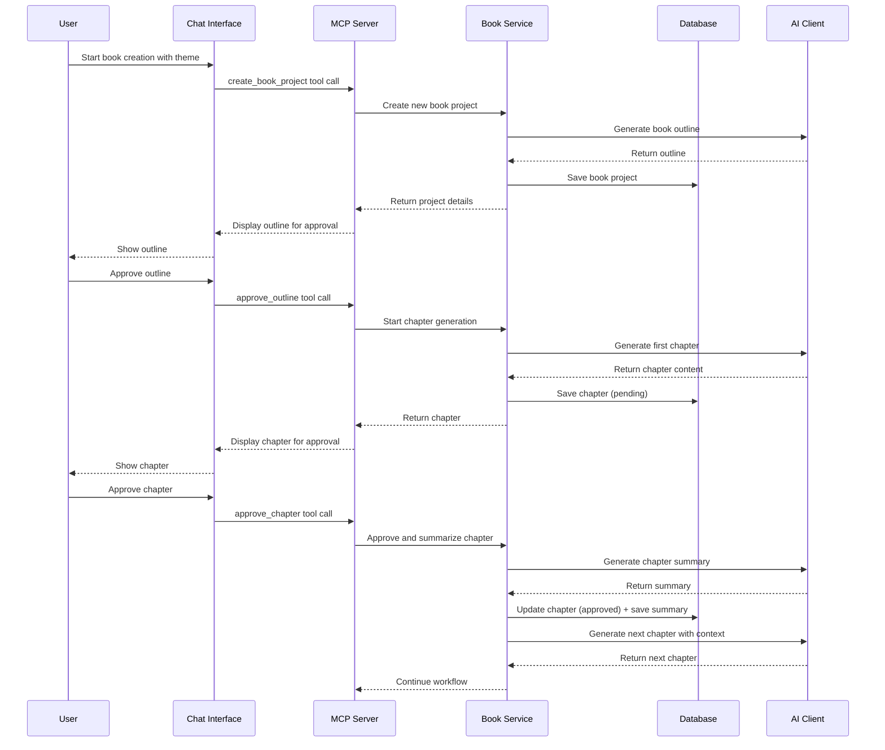

# Design Document

## Overview

The Book Creation MCP Server is a comprehensive system that enables AI-powered book generation with user approval workflows. The system consists of an MCP server that integrates with LibreChat's existing infrastructure, new database models for book management, and a configuration-driven approach that allows customization of the book creation process.

The architecture follows LibreChat's established patterns while introducing new components specifically for book creation workflows. The system maintains state persistence through MongoDB, provides real-time feedback through the chat interface, and ensures user control through approval mechanisms.

## Architecture

### High-Level Architecture



### Component Interaction Flow



## Components and Interfaces

### MCP Server Implementation

The MCP server will be implemented as a standalone Node.js application that follows the Model Context Protocol specification.

**File Structure:**
```
api/app/clients/mcp/
├── book-creation-server/
│   ├── index.js              # Main MCP server entry point
│   ├── tools/                # MCP tool definitions
│   │   ├── createBook.js     # Create book project tool
│   │   ├── approveOutline.js # Approve book outline tool
│   │   ├── approveChapter.js # Approve chapter tool
│   │   ├── regenerateChapter.js # Regenerate chapter tool
│   │   ├── listBooks.js      # List user's books tool
│   │   └── exportBook.js     # Export completed book tool
│   ├── services/             # Business logic services
│   │   ├── BookService.js    # Core book management
│   │   ├── ChapterService.js # Chapter generation and management
│   │   └── ConfigService.js  # Configuration management
│   └── utils/                # Utility functions
│       ├── aiClient.js       # AI integration wrapper
│       └── validators.js     # Input validation
```

**MCP Tools Interface:**

```javascript
// Tool: create_book_project
{
  name: "create_book_project",
  description: "Create a new book project with theme and configuration",
  inputSchema: {
    type: "object",
    properties: {
      theme: { type: "string", description: "The main theme/topic of the book" },
      title: { type: "string", description: "Proposed book title" },
      genre: { type: "string", enum: ["fiction", "non-fiction", "technical", "educational"] },
      chapterCount: { type: "number", minimum: 3, maximum: 50, default: 10 },
      writingStyle: { type: "string", enum: ["formal", "casual", "academic", "creative"] },
      targetAudience: { type: "string", description: "Target audience description" }
    },
    required: ["theme", "title", "genre"]
  }
}

// Tool: approve_chapter
{
  name: "approve_chapter",
  description: "Approve a chapter and proceed to next",
  inputSchema: {
    type: "object",
    properties: {
      bookId: { type: "string", description: "Book project ID" },
      chapterId: { type: "string", description: "Chapter ID to approve" },
      feedback: { type: "string", description: "Optional feedback for improvements" }
    },
    required: ["bookId", "chapterId"]
  }
}
```

### Database Models

**Book Model:**
```javascript
const bookSchema = new mongoose.Schema({
  bookId: { type: String, required: true, unique: true },
  user: { type: mongoose.Schema.Types.ObjectId, ref: 'User', required: true },
  title: { type: String, required: true },
  theme: { type: String, required: true },
  genre: { type: String, enum: ['fiction', 'non-fiction', 'technical', 'educational'], required: true },
  status: { type: String, enum: ['outline_pending', 'in_progress', 'completed', 'cancelled'], default: 'outline_pending' },
  outline: {
    chapters: [{ title: String, description: String }],
    approvedAt: Date
  },
  config: {
    chapterCount: { type: Number, default: 10 },
    writingStyle: { type: String, enum: ['formal', 'casual', 'academic', 'creative'], default: 'casual' },
    targetAudience: String,
    formatting: {
      font: { type: String, default: 'Arial' },
      fontSize: { type: Number, default: 12 },
      lineSpacing: { type: Number, default: 1.5 }
    }
  },
  progress: {
    currentChapter: { type: Number, default: 0 },
    completedChapters: { type: Number, default: 0 },
    totalChapters: { type: Number, required: true }
  },
  metadata: {
    wordCount: { type: Number, default: 0 },
    estimatedReadingTime: { type: Number, default: 0 }
  }
}, { timestamps: true });
```

**Chapter Model:**
```javascript
const chapterSchema = new mongoose.Schema({
  chapterId: { type: String, required: true, unique: true },
  bookId: { type: String, required: true, ref: 'Book' },
  user: { type: mongoose.Schema.Types.ObjectId, ref: 'User', required: true },
  chapterNumber: { type: Number, required: true },
  title: { type: String, required: true },
  content: { type: String, required: true },
  summary: { type: String }, // Generated after approval for context
  status: { type: String, enum: ['pending', 'approved', 'rejected'], default: 'pending' },
  feedback: { type: String }, // User feedback for regeneration
  wordCount: { type: Number, default: 0 },
  generationContext: {
    previousSummaries: [String], // Summaries of previous chapters
    styleInstructions: String,
    specificRequirements: String
  },
  approvedAt: Date,
  rejectedAt: Date
}, { timestamps: true });
```

### Service Layer Architecture

**BookService:**
```javascript
class BookService {
  async createBookProject(userId, bookData) {
    // Validate input
    // Generate unique bookId
    // Create book record
    // Generate initial outline using AI
    // Return book project with outline
  }

  async approveOutline(userId, bookId) {
    // Update book status to 'in_progress'
    // Start first chapter generation
    // Return updated book status
  }

  async getBookProgress(userId, bookId) {
    // Retrieve book with current progress
    // Calculate completion percentage
    // Return progress data
  }

  async exportBook(userId, bookId, format = 'markdown') {
    // Retrieve all approved chapters
    // Format according to specified format
    // Generate downloadable content
    // Return export data
  }
}
```

**ChapterService:**
```javascript
class ChapterService {
  async generateChapter(bookId, chapterNumber, context) {
    // Retrieve book configuration
    // Gather previous chapter summaries
    // Generate chapter content using AI
    // Save chapter with pending status
    // Return chapter data
  }

  async approveChapter(userId, bookId, chapterId, feedback) {
    // Update chapter status to approved
    // Generate chapter summary for future context
    // Update book progress
    // Trigger next chapter generation if not complete
    // Return updated status
  }

  async regenerateChapter(userId, bookId, chapterId, feedback) {
    // Retrieve original chapter and context
    // Incorporate user feedback
    // Generate new version using AI
    // Update chapter content
    // Return updated chapter
  }

  async getChapterContext(bookId, chapterNumber) {
    // Retrieve all previous approved chapters
    // Extract summaries for context
    // Return context data for AI generation
  }
}
```

## Data Models

### Book Configuration Schema

The system supports extensive configuration options that affect the entire book generation process:

```javascript
const bookConfigSchema = {
  content: {
    chapterCount: { type: Number, min: 3, max: 50, default: 10 },
    averageChapterLength: { type: Number, default: 2000 }, // words
    includeIntroduction: { type: Boolean, default: true },
    includeConclusion: { type: Boolean, default: true },
    includeBibliography: { type: Boolean, default: false }
  },
  style: {
    writingStyle: { type: String, enum: ['formal', 'casual', 'academic', 'creative'], default: 'casual' },
    tone: { type: String, enum: ['professional', 'friendly', 'authoritative', 'conversational'], default: 'friendly' },
    perspective: { type: String, enum: ['first-person', 'second-person', 'third-person'], default: 'third-person' },
    targetAudience: { type: String, required: true }
  },
  formatting: {
    font: { type: String, default: 'Arial' },
    fontSize: { type: Number, min: 8, max: 24, default: 12 },
    lineSpacing: { type: Number, enum: [1, 1.15, 1.5, 2], default: 1.5 },
    margins: {
      top: { type: Number, default: 1 },
      bottom: { type: Number, default: 1 },
      left: { type: Number, default: 1 },
      right: { type: Number, default: 1 }
    }
  },
  generation: {
    aiModel: { type: String, default: 'gpt-4' },
    temperature: { type: Number, min: 0, max: 2, default: 0.7 },
    maxTokensPerChapter: { type: Number, default: 4000 },
    includeOutlineInContext: { type: Boolean, default: true },
    summaryLength: { type: String, enum: ['brief', 'detailed'], default: 'brief' }
  }
};
```

### Progress Tracking Schema

```javascript
const progressSchema = {
  bookId: String,
  currentPhase: { type: String, enum: ['outline', 'generation', 'review', 'completed'] },
  currentChapter: Number,
  completedChapters: Number,
  totalChapters: Number,
  percentComplete: Number,
  estimatedTimeRemaining: Number, // minutes
  lastActivity: Date,
  milestones: [{
    phase: String,
    completedAt: Date,
    duration: Number // milliseconds
  }]
};
```

## Error Handling

### MCP Server Error Handling

The MCP server implements comprehensive error handling following LibreChat's patterns:

```javascript
class MCPError extends Error {
  constructor(message, code, details = {}) {
    super(message);
    this.name = 'MCPError';
    this.code = code;
    this.details = details;
  }
}

// Error codes
const ERROR_CODES = {
  BOOK_NOT_FOUND: 'BOOK_NOT_FOUND',
  CHAPTER_NOT_FOUND: 'CHAPTER_NOT_FOUND',
  INVALID_CONFIG: 'INVALID_CONFIG',
  AI_GENERATION_FAILED: 'AI_GENERATION_FAILED',
  UNAUTHORIZED: 'UNAUTHORIZED',
  VALIDATION_ERROR: 'VALIDATION_ERROR'
};
```

### Database Error Handling

- Connection failures: Retry logic with exponential backoff
- Validation errors: Detailed field-level error messages
- Duplicate key errors: Graceful handling with user-friendly messages
- Transaction failures: Rollback mechanisms for multi-document operations

### AI Integration Error Handling

- Rate limiting: Queue management and retry logic
- Token limit exceeded: Content chunking and continuation
- Model unavailable: Fallback to alternative models
- Generation timeout: Partial content saving and resumption

## Testing Strategy

### Unit Testing

**MCP Tools Testing:**
```javascript
describe('Book Creation MCP Tools', () => {
  describe('create_book_project', () => {
    it('should create a new book project with valid input');
    it('should validate required fields');
    it('should generate appropriate outline based on genre');
    it('should handle AI generation failures gracefully');
  });

  describe('approve_chapter', () => {
    it('should approve chapter and generate summary');
    it('should trigger next chapter generation');
    it('should handle final chapter completion');
  });
});
```

**Service Layer Testing:**
```javascript
describe('BookService', () => {
  it('should create book with proper configuration');
  it('should track progress accurately');
  it('should handle concurrent chapter approvals');
  it('should export books in multiple formats');
});

describe('ChapterService', () => {
  it('should generate chapters with proper context');
  it('should incorporate previous chapter summaries');
  it('should handle regeneration with feedback');
});
```

### Integration Testing

- MCP server communication with LibreChat
- Database operations with proper transactions
- AI client integration with error handling
- End-to-end book creation workflow

### Performance Testing

- Concurrent book creation handling
- Large book generation (50+ chapters)
- Database query optimization
- Memory usage during long-running operations

### User Acceptance Testing

- Book creation workflow usability
- Approval process efficiency
- Progress tracking accuracy
- Export functionality validation

## Configuration Integration

### LibreChat Configuration

The MCP server will be configured in `librechat.yaml`:

```yaml
mcpServers:
  book-creation:
    type: stdio
    command: node
    args: ["api/app/clients/mcp/book-creation-server/index.js"]
    env:
      MONGODB_URI: "${MONGODB_URI}"
      AI_MODEL_DEFAULT: "gpt-4"
      MAX_CONCURRENT_GENERATIONS: "3"
    disabled: false
    chatMenu: true
    customUserVars:
      preferred_genre:
        type: string
        description: "Your preferred book genre"
        default: "non-fiction"
      default_chapter_count:
        type: number
        description: "Default number of chapters"
        default: 10
        min: 3
        max: 50
```

### Runtime Configuration

The system supports dynamic configuration updates through the database, allowing users to modify settings without server restart:

- Writing style preferences
- Chapter length targets
- AI model selection
- Export format options

This design provides a robust, scalable, and user-friendly book creation system that integrates seamlessly with LibreChat's existing architecture while introducing powerful new capabilities for AI-assisted content creation.