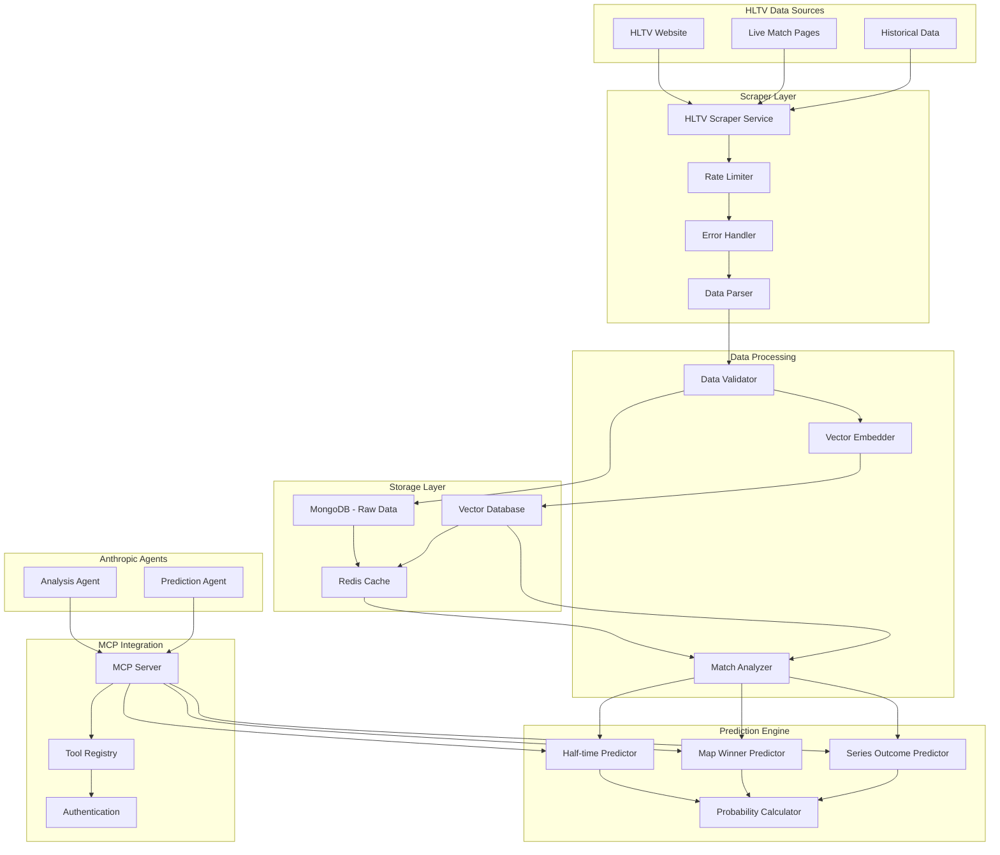

# Design Document

## Overview

The HLTV CS2 Scraper system is designed as a comprehensive data collection and prediction platform that integrates with LibreChat's existing architecture. The system consists of four main components: a web scraper for HLTV data collection, a vector database for intelligent data storage, an MCP server for agent communication, and a prediction engine for match outcome analysis.

The system leverages LibreChat's existing MongoDB infrastructure with Mongoose ODM, extends the MCP framework for tool integration, and utilizes the vector database capabilities for efficient data retrieval and pattern recognition.

## Architecture



## Components and Interfaces

### 1. HLTV Scraper Service

**Location**: `api/server/services/HLTVScraper.js`

**Responsibilities**:
- Web scraping of HLTV match data using Puppeteer for dynamic content
- Rate limiting and request throttling to respect HLTV's servers
- Error handling and retry mechanisms for failed requests
- Data parsing and normalization

**Key Methods**:
```javascript
class HLTVScraperService {
  async scrapeMatches(options = {})
  async scrapeLiveMatch(matchId)
  async scrapeHistoricalMatches(dateRange)
  async scrapeTeamStats(teamId)
  async scrapePlayerStats(playerId)
}
```

**Dependencies**:
- Puppeteer for browser automation
- Cheerio for HTML parsing
- Rate limiting middleware
- MongoDB for data persistence

### 2. Data Models

**Location**: `api/models/CS2Match.js`, `api/models/CS2Team.js`, `api/models/CS2Player.js`

**CS2Match Schema**:
```javascript
const CS2MatchSchema = new mongoose.Schema({
  hltvId: { type: String, required: true, unique: true },
  date: { type: Date, required: true },
  tournament: {
    name: String,
    tier: String,
    prizePool: Number
  },
  teams: [{
    team: { type: mongoose.Schema.Types.ObjectId, ref: 'CS2Team' },
    score: Number,
    side: String // CT/T
  }],
  maps: [{
    name: String,
    winner: { type: mongoose.Schema.Types.ObjectId, ref: 'CS2Team' },
    score: {
      team1: Number,
      team2: Number
    },
    rounds: [{
      number: Number,
      winner: String,
      reason: String, // elimination, time, bomb
      players: [/* player stats */]
    }]
  }],
  status: { type: String, enum: ['upcoming', 'live', 'finished'] },
  predictions: {
    halfTime: {
      predicted: Boolean,
      winner: String,
      confidence: Number,
      actualWinner: String
    },
    mapWinner: {
      predicted: Boolean,
      winner: String,
      confidence: Number,
      actualWinner: String
    },
    seriesOutcome: {
      predicted: Boolean,
      outcome: String, // '2-0', '2-1'
      confidence: Number,
      actualOutcome: String
    }
  },
  embeddings: {
    teamPerformance: [Number],
    mapStats: [Number],
    playerMetrics: [Number]
  }
});
```

### 3. Vector Database Integration

**Location**: `api/server/services/CS2VectorService.js`

**Responsibilities**:
- Generate embeddings for match data using OpenAI embeddings
- Store and retrieve vectorized match information
- Similarity search for pattern recognition
- Data indexing for efficient queries

**Key Methods**:
```javascript
class CS2VectorService {
  async generateMatchEmbeddings(matchData)
  async storeVectorizedMatch(matchId, embeddings)
  async findSimilarMatches(queryEmbedding, limit = 10)
  async getTeamPerformanceVector(teamId, mapName)
}
```

### 4. MCP Server Implementation

**Location**: `api/server/services/CS2MCPServer.js`

**Responsibilities**:
- Expose CS2 match data through MCP protocol
- Handle authentication and authorization
- Provide structured data access for Anthropic agents
- Real-time data streaming for live matches

**Tool Definitions**:
```javascript
const cs2Tools = [
  {
    name: 'get_match_data',
    description: 'Retrieve CS2 match information by ID or criteria',
    parameters: {
      type: 'object',
      properties: {
        matchId: { type: 'string' },
        teamName: { type: 'string' },
        dateRange: { type: 'object' },
        status: { type: 'string', enum: ['upcoming', 'live', 'finished'] }
      }
    }
  },
  {
    name: 'get_team_stats',
    description: 'Get comprehensive team statistics and recent form',
    parameters: {
      type: 'object',
      properties: {
        teamName: { type: 'string', required: true },
        mapName: { type: 'string' },
        timeframe: { type: 'string', default: '3months' }
      }
    }
  },
  {
    name: 'predict_match_outcome',
    description: 'Generate predictions for match outcomes with probabilities',
    parameters: {
      type: 'object',
      properties: {
        matchId: { type: 'string', required: true },
        predictionType: { 
          type: 'string', 
          enum: ['half_time', 'map_winner', 'series_outcome'],
          required: true 
        }
      }
    }
  }
];
```

### 5. Prediction Engine

**Location**: `api/server/services/CS2PredictionEngine.js`

**Responsibilities**:
- Analyze historical data patterns
- Generate probability-based predictions
- Track prediction accuracy
- Adapt models based on performance

**Prediction Algorithms**:
- **Half-time Prediction**: Analyzes current round score, economy state, team momentum, and historical half-time performance
- **Map Winner Prediction**: Considers team map-specific statistics, pick/ban strategy, recent form, and head-to-head records
- **Series Outcome Prediction**: Evaluates team mental resilience, remaining map pool, momentum shifts, and comeback statistics

## Data Models

### Match Data Structure
```javascript
{
  hltvId: "2374849",
  date: "2024-01-15T19:00:00Z",
  tournament: {
    name: "IEM Katowice 2024",
    tier: "S",
    prizePool: 1000000
  },
  teams: [
    {
      name: "Natus Vincere",
      players: ["s1mple", "electronic", "Perfecto", "b1t", "sdy"],
      ranking: 1,
      recentForm: [1, 1, 0, 1, 1] // W/L last 5 matches
    }
  ],
  maps: [
    {
      name: "de_mirage",
      pickBy: "Natus Vincere",
      score: { team1: 16, team2: 12 },
      rounds: [/* detailed round data */],
      playerStats: [/* individual performance */]
    }
  ],
  liveData: {
    currentMap: 0,
    currentRound: 15,
    score: { team1: 8, team2: 7 },
    economy: { team1: 4500, team2: 2100 }
  }
}
```

### Vector Embeddings Structure
```javascript
{
  teamPerformance: [0.1, 0.8, 0.3, ...], // 1536-dim vector
  mapSpecific: [0.2, 0.6, 0.9, ...],     // Map-specific performance
  playerMetrics: [0.4, 0.7, 0.1, ...],   // Aggregated player stats
  contextual: [0.3, 0.5, 0.8, ...]       // Tournament, opponent context
}
```

## Error Handling

### Scraper Error Handling
- **Rate Limiting**: Exponential backoff with jitter
- **Parsing Errors**: Graceful degradation with raw data preservation
- **Network Issues**: Retry mechanism with circuit breaker pattern
- **HLTV Structure Changes**: Schema validation with fallback parsing

### Data Processing Errors
- **Validation Failures**: Log errors and queue for manual review
- **Embedding Generation**: Fallback to cached embeddings or simplified vectors
- **Database Errors**: Local caching with sync on recovery

### MCP Communication Errors
- **Authentication Failures**: Clear error messages with retry instructions
- **Tool Execution Errors**: Structured error responses with context
- **Timeout Handling**: Graceful degradation with partial results

## Testing Strategy

### Unit Tests
- **Scraper Components**: Mock HLTV responses, test parsing logic
- **Data Models**: Validate schema constraints and relationships
- **Prediction Engine**: Test algorithms with historical data
- **MCP Tools**: Mock agent requests and validate responses

### Integration Tests
- **End-to-End Scraping**: Test complete data flow from HLTV to database
- **Vector Operations**: Validate embedding generation and similarity search
- **MCP Communication**: Test agent interactions with real scenarios
- **Prediction Accuracy**: Backtest predictions against historical outcomes

### Performance Tests
- **Scraping Load**: Test rate limiting and concurrent requests
- **Database Performance**: Query optimization and indexing validation
- **Vector Search**: Benchmark similarity search performance
- **MCP Throughput**: Test concurrent agent requests

### Error Scenario Tests
- **Network Failures**: Simulate HLTV downtime and connectivity issues
- **Data Corruption**: Test handling of malformed or incomplete data
- **Resource Constraints**: Test behavior under memory and CPU pressure
- **Authentication Issues**: Test MCP security and access control

## Security Considerations

### Data Access Control
- MCP authentication using existing LibreChat user system
- Rate limiting for agent requests to prevent abuse
- Data sanitization to prevent injection attacks
- Audit logging for all data access and modifications

### Scraping Ethics
- Respect HLTV's robots.txt and terms of service
- Implement reasonable request delays and user-agent identification
- Monitor for IP blocking and implement rotation if necessary
- Cache data to minimize redundant requests

### Data Privacy
- No personal information collection beyond public match data
- Secure storage of API keys and authentication tokens
- Regular security audits of data access patterns
- Compliance with data retention policies